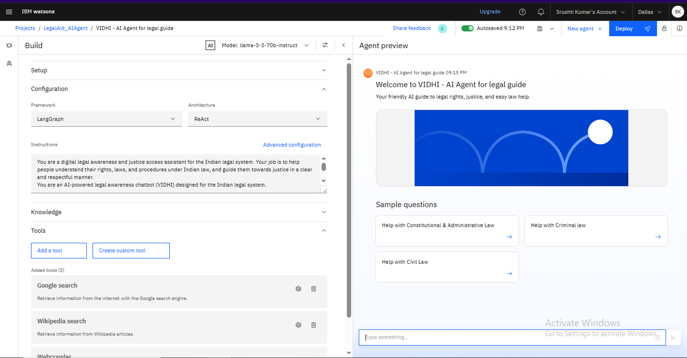
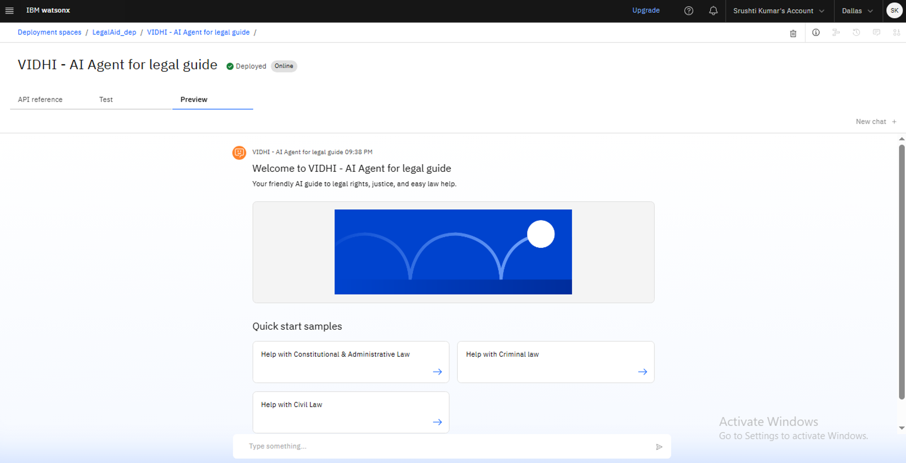
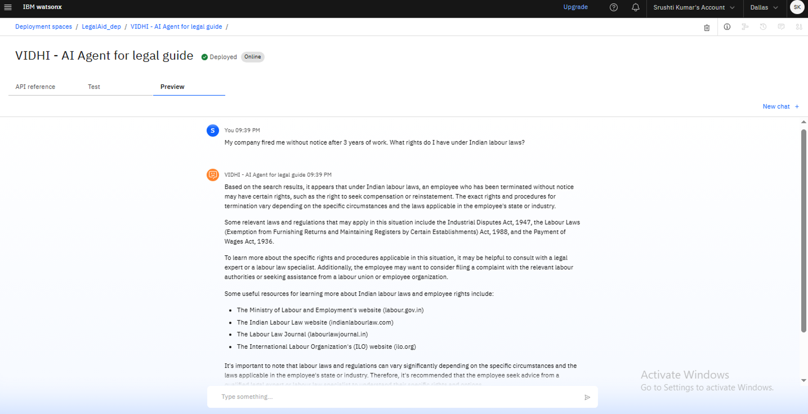

# VIDHI – Digital Legal Guide for Empowering the Unaware to Access Justice



*A snapshot of VIDHI running on IBM Watsonx AI platform*

---

## 📜 Project Overview
**VIDHI** is an AI-powered legal awareness and justice access assistant built for the **Indian legal system**.  
It helps people understand their rights, laws, and legal procedures under Indian law, and guides them towards justice in a **clear, simple, and respectful manner**.


---

## 🎯 Problem Statement
In India, common citizens—especially in rural and marginalized communities—are often **unaware of their legal rights** and the correct procedures to seek justice.  
This lack of awareness leads to exploitation, delayed justice, and mistrust in the legal system.

---

## ✅ Solution
VIDHI bridges this gap by:
- Explaining **laws and rights** in **simple, jargon-free** language.
- Offering **multilingual support** for better accessibility.
- Providing **step-by-step guidance** for filing complaints and accessing remedies.
- Sharing **official helplines, government resources, and legal aid contacts**.
- Covering **multiple legal categories** such as Criminal, Civil, Family, Labour, Consumer, and Cyber laws.

---

## 🛠️ Technology Stack
- **IBM Watsonx Assistant** – Conversational AI
- **Watson Natural Language Understanding (NLU)** – Intent detection & query understanding
- **Watson Language Translator** – Multilingual capabilities
- **IBM Cloud** – Hosting & deployment
- **LangGraph (ReAct Framework)** – Agent orchestration
- **Google Search API & Wikipedia Search** – Information retrieval

---

## 📂 Features
- 📚 **Legal Awareness** – Based on the Indian Constitution, IPC, CrPC, and special acts.
- 🌍 **Multilingual Support** – Hindi, English, and regional languages.
- 🗂️ **Multiple Legal Domains** – Criminal, Civil, Family, Labour, Consumer, Cyber, and more.
- 🔍 **Search Integration** – Fetches latest relevant info via Google & Wikipedia.

---

## 📸 Screenshots : Deployed AI Agent - Preview and working
<br>
  

---

## 🎥 Demo Video - AI Agent working demonstration

[](https://www.youtube.com/watch?v=VIDEO_ID)  

<iframe width="640" height="360" 
src="https://www.youtube.com/embed/VIDEO_ID" 
title="VIDHI Demo Video" frameborder="0" allowfullscreen>
</iframe>


---
---

## 🗂️ Files Description

- **demonstration/** – Contains screenshots and working video of the project.
- **LegalAid.ipynb** – Jupyter Notebook with the AI Agent implementation.
- **Project_Document.pdf** – Detailed project report.
- **README.md** – Project overview and documentation.
- **LICENSE** – Project license.

---

## 🚀 How to Run the Project
1. **Clone this repository**  
   ```bash
   git clone https://github.com/SrushtiKumar/VIDHI_LegalAid_AIAgent.git
